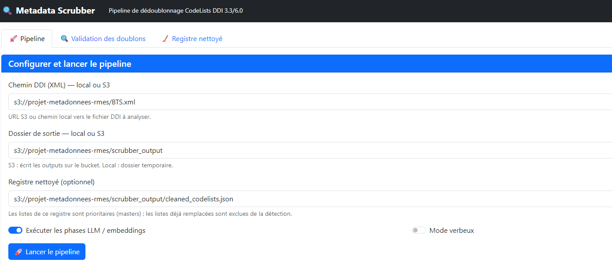
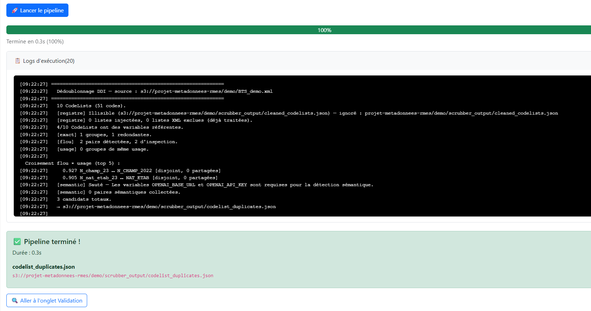
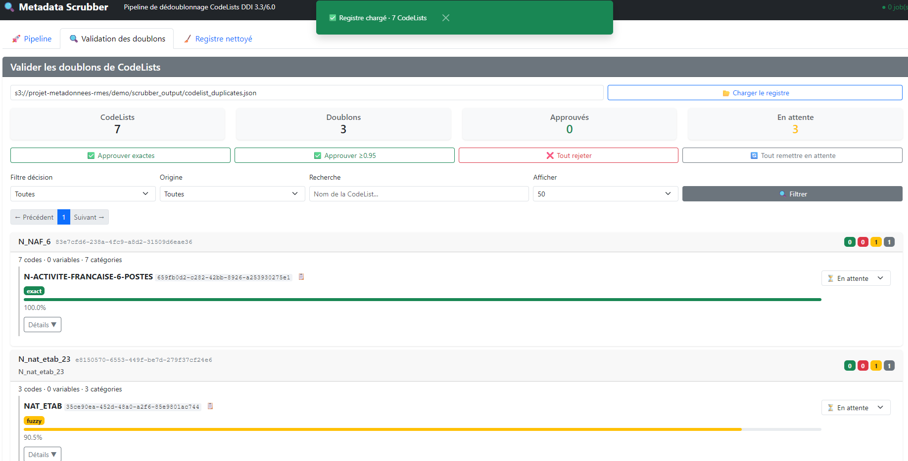
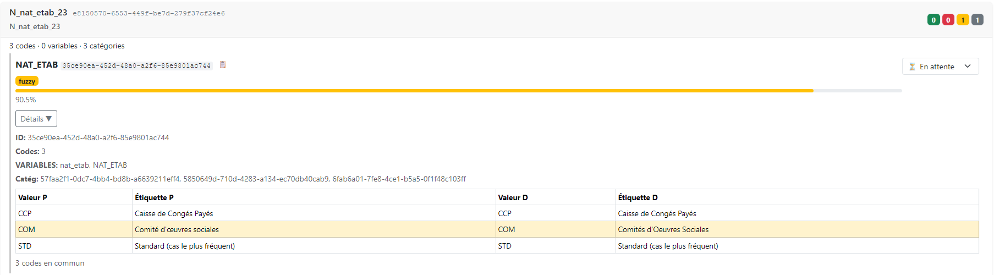
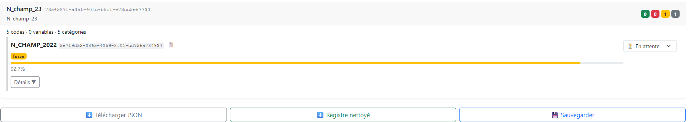
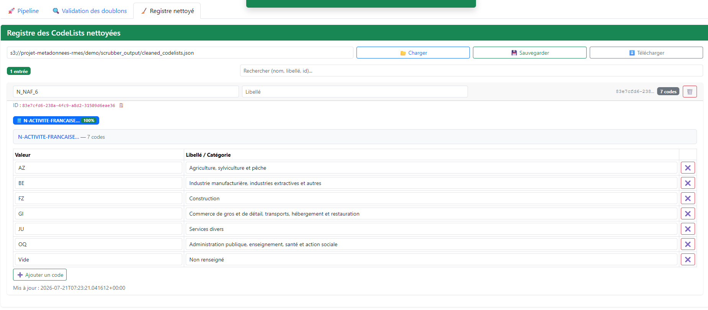

# Introduction

Le **Metadata Scrubber** est un outil qui identifie les listes de codes (`CodeList`)
redondantes au sein d'un fichier de métadonnées au format DDI (Data Dictionary
Interface). Il propose deux modes d'utilisation complémentaires :

- **Exécution automatique** — analyse le fichier XML DDI et génère un registre de
  paires de CodeLists détectées comme potentiellement redondantes.
- **Interface de validation interactive** — permet d'examiner chaque paire, prendre
  des décisions (consolider ou rejeter), et produire en sortie un registre épuré
  ne conservant qu'une CodeListe maîtresse par groupe de redondances.

Ce document s'adresse à l'**expert métier** qui utilise l'interface web pour examiner
les résultats et valider les rapprochements. La logique algorithmique du pipeline
(entonnoir exact → flou → sémantique) est décrite en détail dans la
[note méthodologique](note_methodologique_dedoublonnage.qmd) (§ 8).

---

# Prérequis

Le serveur du Metadata Scrubber doit être en cours d'exécution. Sur SSP Cloud / Onyxia,
il est déployé sous le hostname `metadata-scrubber.lab.sspcloud.fr` avec un accès
protégé par Basic Auth.

Au premier chargement, un formulaire de navigateur demande :

- **Identifiant** — votre nom d'utilisateur ou identifiant SSP Cloud
- **Mot de passe** — le mot de passe partagé fourni dans la configuration du projet

> L'interface est également accessible en local après avoir lancé le serveur :
> `uv run scrubber-web`, puis ouvrez `http://localhost:8000`.

---

# Lancer le pipeline

Le premier onglet de l'interface (**🚀 Pipeline**) sert à configurer et lancer
l'exécution automatique du dédoublonnage sur un fichier DDI.

## Configurer le pipeline

Quatre champs paramètrent le run :

| Champ | Rôle |
|---|---|
| **Chemin source DDI (XML)** | URL S3 ou chemin local vers le fichier DDI à analyser. |
| **Dossier de sortie** | Emplacement où sera écrit le registre de doublons. |
| **Registre nettoyé** (optionnel) | Chemin vers un `cleaned_codelists.json` préexistant. Les CodeLists maîtres de ce registre sont injectées comme candidates prioritaires ; les doublons déjà validés sont exclus de la détection. |
| **Exécuter les phases LLM / embeddings** | Décocher pour un run rapide (exact + flou uniquement, sans embeddings ni juge LLM). |
| **Mode verbeux** | Afficher les détails d'exécution (étapes d'embeddings, messages LLM …) dans les logs. |

{width="700px"}

## Exécuter le pipeline

Après avoir complété les champs, cliquez sur **🚀 Lancer le pipeline**.

La barre de progression apparaît et avance en temps réel :

- **Pourcentage** : progression globale (0 % → 100 %)
- **Texte de phase** : indique l'étape en cours, par exemple `Phase 5/9 — Détection exacte`
- **Logs d'exécution** : panneau rétractable affichant la sortie détaillée du pipeline

Cliquez sur le bouton **📋 Logs d'exécution** pour déplier le texte brut de l'exécution : timestamps, messages de chaque phase, noms des CodeLists traitées, résultats des comparaisons.

{width="700px"}

> **Temps d'exécution estimé** : quelques secondes pour un petit fichier
> (< 500 Ko), 1–3 minutes pour un fichier standard. La phase LLM (embeddings
> + juge) peut ajouter plusieurs minutes supplémentaires.

## Résultat

En fin d'exécution, une alerte verte affiche :

- Le nombre de CodeLists traitées
- Le nombre de paires de doublons détectées
- Le chemin du fichier produit
- Un bouton pour aller directement à l'onglet **Validation des doublons**

---

# Examiner et valider les doublons

Le deuxième onglet (**🔍 Validation des doublons**) est au cœur du travail de
l'expert. Il présente le registre des paires de CodeLists détectées comme
potentiellement redondantes sous forme de cartes, avec des filtres, des
actions par paire et des actions de masse.

## Charger le registre

Si un pipeline n'a pas été lancé depuis l'interface, chargez un registre
préexistant :

1. Saisissez le chemin (S3 ou local) vers le fichier de sortie du pipeline, par
   exemple `s3://projet-metadonnees-rmes/scrubber_output/codelist_duplicates.json`
2. Cliquez sur **📂 Charger le registre**
3. Les résultats s'affichent alors sous forme de cartes

## Vue d'ensemble

Quatre indicateurs en haut de page résument l'état du registre :

| Indicateur | Signification |
|---|---|
| **CodeLists** | Nombre total de CodeLists dans le fichier analysé |
| **Doublons** | Nombre de CodeLists marquées comme potentiellement redondantes |
| **Approuvés** | Pairs pour lesquelles l'expert a validé le rapprochement |
| **En attente** | Paires n'ayant pas encore été examinées |

Chaque CodeListe est présentée sous forme de **carte** comportant :

- Le **nom** de la CodeListe et un bouton **Voir** à côté (pour la comparaison)
- Le **nombre de codes**
- Le **score de confiance** (0–100 %)
- Le **badge de décision** : 🟡 en attente, 🟢 approuvé, 🔴 rejeté
- Les **signaux de détection** : *exact*, *flou*, *usage*, *synonyme*, *semantic*
- Un bouton **📋 Détails** affichant une liste `(valeur → libellé)` pour chaque
  CodeListe du groupe

{width="700px"}

## Comparer côte à côte

Cliquez sur **Voir** (à côté du nom de la CodeListe) pour ouvrir le panneau de
comparaison en deux colonnes :

- **Colonne gauche** : la CodeListe maître (la plus récente, ou celle retenue)
- **Colonne droite** : la CodeListe candidate détectée comme redondante
- **Lignes colorées** : les lignes où les valeurs ou libellés diffèrent entre
  les deux listes (mise en évidence rouge)
- Les **codes communs** (valeur + libellé identiques) ne sont pas colorés

{width="700px"}

Cette vue permet de juger rapidement si la différence entre les deux listes est
un simple artefact (casse, accent, ordre des codes) ou un changement réel de
contenu.

## Décisions par paire

Sous chaque paire de CodeLists, trois boutons permettent de prendre une décision :

- **✅ Approuver** — les listes sont redondantes, la candidate doit être remplacée
- **❌ Rejeter** — les listes sont distinctes, le rapprochement est incorrect
- **🔄 En attente** — la décision est remise à plus tard (état par défaut)

Chaque changement de décision met à jour le badge coloré de la carte.

## Actions de masse

Quatre boutons en haut de la page permettent d'appliquer des décisions à
plusieurs paires simultanément :

| Bouton | Effet |
|---|---|
| **✅ Valider exactes** | Applique *Approuver* à toutes les paires détectées par correspondance **exacte** (100 % de confiance automatique) |
| **✅ Valider ≥ 0.95** | Applique *Approuver* à toutes les paires avec un score de confiance supérieur ou égal à 95 % |
| **❌ Tout rejeter** | Applique *Rejeter* à toutes les paires restées en attente |
| **🔄 Tout remettre en attente** | Remet toutes les décisions en état *En attente* (permet de reprendre le parcours) |

## Filtres

Pour se concentrer sur un sous-ensemble de CodeLists :

- **Filtre décision** : *Toutes* / *En attente* / *Approuvés* / *Rejetés* / *Sans doublon*
- **Filtre origine** : *Toutes* / *Registre uniquement* (uniquement les CodeLists qui sont des maîtres d'un registre existant)
- **Recherche** : champ texte — recherche par nom de la CodeListe
- **Afficher** : 20 / 50 / 100 éléments par page

## Sauvegarder les décisions

Après examen, cliquez sur **💾 sauvegarder**. L'interface :

1. Met à jour les états `decision` dans le registre `codelist_duplicates.json`
2. Génère ou met à jour le **registre nettoyé** `cleaned_codelists.json`

Une notification (toast) verte apparaît en confirmation :

{width="500px"}

> **Ce que la sauvegarde produit** : `cleaned_codelists.json` ne contient que
> les CodeLists maîtres — celles qui ont été approuvées et celles marquées
> "sans doublon". Chaque maître possède un champ `replaces[]` listant les
> CodeLists redondantes qu'il remplace. Ce fichier est un input pour les runs
> suivants (workflow itératif, § 6.2).

## Ajouter une CodeListe au registre

Lorsqu'une CodeListe n'a aucun doublon détecté, l'expert peut décider tout de
même de l'ajouter au registre épuré :

1. Cliquez sur le bouton **➕ Ajouter au registre** (en haut de la carte de la
   CodeListe concernée, accessible via le bouton **📋 Détails** ou dans la
   vue comparée)
2. La CodeListe apparaît alors comme maître dans le registre nettoyé
3. La sauvegarde (**💾 sauvegarder**) écrit cette entrée dans
   `cleaned_codelists.json`

> À utiliser pour les CodeLists uniques mais importantes qu'on souhaite
> conserver comme référence dans le registre propre.

---

# Registre nettoyé

Le troisième onglet (**🧹 Registre nettoyé**) permet de consulter, éditer et
sauvegarder le registre épuré — la base de connaissances cumulée des
CodeLists validées.

## Charger le registre

1. Saisissez le chemin vers le fichier `cleaned_codelists.json`
2. Cliquez sur **📂 Charger**

L'interface affiche alors la liste des CodeLists maîtres avec leurs remplaçants.

{width="700px"}

## Contenu d'une entrée

Chaque carte de CodeListe maître contient :

- **Nom** et **label** (libellé)
- **Nombre de codes**
- **Codes** : liste de paires `(valeur → libellé)` dans un bloc copiable
- **Variables référentes** : noms des variables DDI qui référencent cette CodeListe
- **Replace** : badge indiquant le nombre de CodeLists redondantes remplacées
  (cliquable, affiche la liste détaillée des remplaçants — nom, type de
  détection, score de confiance)

## Édition

Les champs **Nom** et **Label** de chaque entrée sont modifiables directement
dans le navigateur. Les champs **Codes** et **Variables** sont en lecture seule.

Le dirty tracking est signalé par un **badge orange** en haut de la page :
*modifications non sauvegardées*. Les modifications restent locales jusqu'au
clic sur **💾 Sauvegarder**.

## Sauvegarder et télécharger

| Bouton | Effet |
|---|---|
| **💾 Sauvegarder** | Écrit l'état actuel du registre vers le chemin S3 ou local spécifié |
| **⬇️ Télécharger** | Télécharge le registre en tant que fichier JSON dans le navigateur |

Le bouton **📂 Charger** permet de recharger le registre à tout moment (utile pour
reprendre une session ou charger une version mise à jour).

---

# Workflow de validation

Cette section décrit le parcours typique d'un expert, de l'exécution du pipeline
à l'obtention d'un registre épuré, en passant par l'examen et la validation
des paires détectées.

## Un run complet

Le circuit se décompose en 5 étapes :

1. **Exécuter le pipeline** (§ 3) — configurez le chemin source et lancez le
   pipeline. Le résultat est un fichier de doublons.

2. **Examiner les cartes** (§ 4.1–4.2) — passez à l'onglet **Validation**,
   chargez le registre si nécessaire, et parcourrez les cartes. Les cartes
   sont triées par nombre de codes par défaut, mais vous pouvez les filtrer
   par décision, origine ou recherche textuelle.

3. **Comparer par paire** (§ 4.3) — pour chaque paire douteuse, cliquez sur
   **Voir** pour comparer les deux CodeLists côte à côte. Les lignes
   colorées en rouge indiquent les différences de contenu.

4. **Prendre des décisions** (§ 4.4–4.5) — pour chaque paire, cliquez sur
   **✅ Approuver** (les listes sont redondantes) ou **❌ Rejeter** (les
   listes sont distinctes). Les actions de masse (§ 4.5) permettent de
   accélérer le traitement des paires à fort score de confiance.

5. **Sauvegarder** (§ 4.7) — une fois toutes les décisions prises (ou avant
   de reprendre plus tard), cliquez sur **💾 sauvegarder**. Ceci met à jour
   le registre `codelist_duplicates.json` et écrit le registre nettoyé
   `cleaned_codelists.json`.

> **Bonnes pratiques** : sauvegardez régulièrement, même partiellement. Un clic
> sur **💾 sauvegarder** peut être fait à tout moment — les décisions validées
> sont conservées. Le bouton **🔄 Tout remettre en attente** permet de reprendre
> le parcours depuis le début sans perdre les modifications intermédiaires.

## Workflow itératif

Les runs successifs s'enrichissent mutuellement grâce au registre propre :

```
Step 1 — Analyser BTS
  Pipeline → examiner → décider → sauvegarder
  ↓
  cleaned_codelists.json = maîtres BTS + leurs replaces

Step 2 — Analyser BPE
  Chemin source → BPE.xml
  Registre nettoyé → cleaned_codelists.json (issu de BTS)
  Pipeline → examiner → décider → sauvegarder
  ↓
  cleaned_codelists.json = maîtres BTS + maîtres BPE + leurs replaces
```

**Pourquoi c'est utile :**

- Les doublons déjà validés (ex. `N_NAF_6`) sont **exclus de la détection** :
  on ne les redécouvre pas dans des runs ultérieurs.
- Les nouveaux doublons sont détectés **par rapport aux maîtres cumulés** :
  une CodeListe BPE peut être reconnue comme doublon d'une CodeListe BTS,
  même si aucune des deux ne figure dans le même fichier.
- Le registre propre **croît** à chaque run et constitue une référence
  transversale sur tout le projet.

**Dans l'interface** : saisissez simplement le chemin `cleaned_codelists.json`
dans le champ **Registre nettoyé** de l'onglet Pipeline avant de lancer le
nouveau run.

## Ajouter des listes sans doublon

Lorsqu'une CodeListe n'est détectée comme doublon de personne par le pipeline
(ex. `L_QUALITE_ZONAGE_2023` dans l'exemple BPE_demo), vous pouvez la
**ajouter manuellement** au registre propre :

1. Consultez la CodeListe dans l'onglet **Validation** (ou via son détail)
2. Cliquez sur **➕ Ajouter au registre**
3. Sauvegardez (**💾 sauvegarder**) — la liste apparaît dans `cleaned_codelists.json`
   comme maître sans remplacent.

> Cette fonctionnalité est particulièrement utile pour les CodeLists uniques
> mais essentielles, ou lorsque vous souhaitez créer une référence maître pour
> un nouveau concept métier avant d'identifier ses variantes.

---

# Astuces pratiques

**Run rapide (prototype)** — décochez **Exécuter les phases LLM / embeddings**
pour un run 5 à 10 × plus rapide. Le pipeline se contente des phases exacte
et floue ; la phase sémantique (embeddings + juge LLM) est omise.

**Sauvegarder régulièrement** — les décisions ne sont pas persistées
automatiquement. Un clic sur **💾 sauvegarder** est nécessaire après chaque
session de travail pour que les décisions et le registre propre soient écrits.

**Reprendre une session** — recharger le registre avec **📂 Charger** (onglet
Validation ou Registre nettoyé) restaure les décisions précédentes.
Tout est conservé dans le fichier JSON.

**Documentation API automatique** — la documentation OpenAPI complète de l'API
REST est disponible à l'URL `/docs` (Swagger UI) et `/redoc`. Elle liste
tous les endpoints, leurs paramètres et leurs réponses.

---

# Note méthodologique

Un entonnoir en trois niveaux — **exact** (signature identique) → **flou**
(Similarity ≥ 0.90) → **sémantique** (embeddings + juge LLM) — permet de
couvrir toutes les formes de redondance : copies conformes, variantes
mineures (casse, accents, ordre), synonymes conceptuels, et doublons
cross-fichier.

Le signal d'usage (`var_sig` — variables qui référencent les CodeLists)
et le registre propre (`cleaned_codelists.json`) complètent cette approche
pour obtenir un dédoublonnage transversal, cumulatif et reproductible.

Pour le détail complet de l'algorithme et des résultats sur BTS.xml (156
CodeLists, 29 groupes de doublons, 54 CodeLists redondantes), consultez la
[note méthodologique](note_methodologique_dedoublonnage.qmd). (source : note
méthodologique, § 2).
